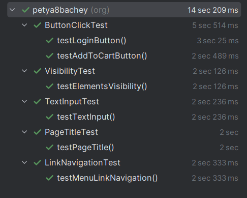

# Лабораторная работа по тестированию веб-сайта с использованием Selenium WebDriver

Результаты тестов



## Описание проекта

Этот проект содержит набор автоматизированных тестов для веб-сайта "Swag Labs" (https://www.saucedemo.com/), разработанных с использованием Selenium WebDriver на Java. Тесты охватывают основные функциональные возможности сайта, включая проверку элементов интерфейса, навигацию и взаимодействие с формами.

## Технологии

- Java 17
- Selenium WebDriver 4.32.0
- JUnit 5
- Maven

## Набор тестов

Проект содержит следующие тесты:

1. **PageTitleTest** - проверка заголовка страницы
2. **VisibilityTest** - проверка видимости элементов интерфейса
3. **LinkNavigationTest** - тестирование перехода по ссылкам
4. **TextInputTest** - тестирование заполнения текстовых полей
5. **ButtonClickTest** - тестирование нажатия кнопок (включая тест логина и добавления товара в корзину)

## Структура проекта

```
src/
├── main/
│   └── java/org/petya8bachey/
│       └── Main.java
└── test/
    └── java/org/petya8bachey/
        ├── BaseTest.java          # Базовый класс для настройки тестов
        ├── ButtonClickTest.java   # Тесты нажатия кнопок
        ├── LinkNavigationTest.java # Тесты навигации
        ├── PageTitleTest.java     # Тесты заголовка страницы
        ├── TextInputTest.java     # Тесты текстовых полей
        └── VisibilityTest.java    # Тесты видимости элементов
```

## Отчет о тестировании

Тесты покрывают следующие аспекты функциональности сайта:

1. **Проверка заголовка страницы** - убеждаемся, что заголовок соответствует ожидаемому
2. **Проверка видимости объектов** - проверяем, что основные элементы интерфейса отображаются
3. **Переход по ссылке** - тестируем навигацию по сайту
4. **Заполнение текстового поля** - проверяем работу полей ввода
5. **Эмуляция нажатия на кнопку** - тестируем основные действия пользователя (логин, добавление товара)

Все тесты выполняются в изолированном окружении благодаря базовому классу `BaseTest`, который настраивает и завершает работу драйвера для каждого теста.